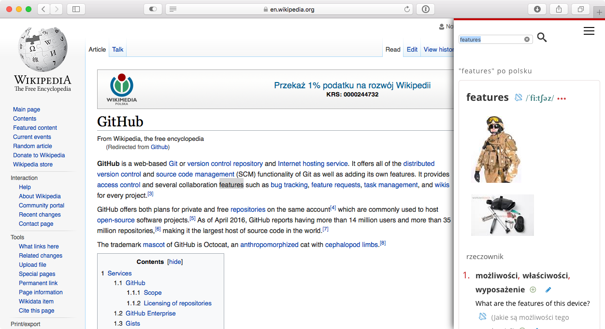

# diki.safariextension
Safari extension to lookup word in diki.pl dictionary

**Everything what you need to do is double click specific word. You can also select that word and double press `d` key. To close diki.pl window just click somewhere else**
